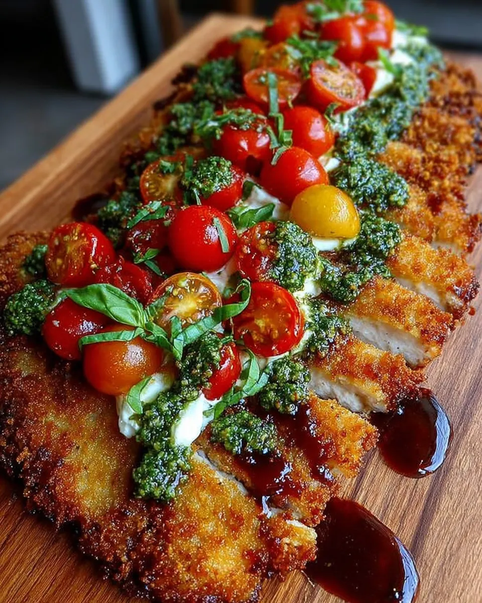

# Mediterranean Keto Chicken Cutlets із збитою фетою та базиліковою олією

### 🛒 Інгредієнти

**Для курки (Air Fryer):**

- **Куряча грудка (невелика):** 1 шт. (приблизно 200–250 г)
- **Мигдалеве борошно:** 2–3 ст. л. (для першої паніровки)
- **Яйце:** 1 шт. (збите)
- **Мигдалева крихта (almond meal) або подрібнений мигдаль:** 1/2 склянки
- **Пармезан (тертий):** 2 ст. л.
- **Спеції:** по 1/2 ч. л. часникового порошку, паприки, солі та чорного перцю
- **Оливкова олія:** спрей для збризкування

**Для гарніру та соусів:**

- **Чері-томати:** 7-9 шт.
- **Фета:** 100 г
- **Грецький йогурт:** 50 г (2 ст. л. з гіркою)
- **Лимонний сік:** 1 ч. л.
- **Свіжий базилік (з твого балкона):** невелика жменя
- **Оливкова олія (Extra Virgin):** 2–3 ст. л.
- **Сіль:** дрібка

---

### 🥣 Процес приготування

**1. Підготовка курки та томатів:**

- Розріж курячу грудку вздовж на два або три тонкі кутлети (слайси). Злегка відбий їх через плівку.
- Підготуй три тарілки:

1. **Мигдалеве борошно:** 2–3 ст. л.
2. 1 **збите яйце**;
3. Суміш:
   - **Подрібнений мигдаль:** 1/2 склянки
   - **Пармезан (тертий):** 2 ст. л.
   - **Часниковий порошк:** 1/2 ч. л.
   - **Паприка:** 1/2 ч. л.
   - **Сіль:** 1/2 ч. л.
   - **Чорний перець:** 1/2 ч. л.

- Обваляй кожен шматочок у мигдалевому борошні, потім у яйці, і наприкінці — у мигдалево-пармезановій паніровці. Добре притисни паніровку руками.

**2. Приготування в аерогрилі:**

- Розігрій аерогриль до **200°C**.
- Виклади** кутлети в кошик**. Поруч (або в окрему форму) поклади **7-9 чері-томати**, збризнуті оливковою олією.
- Обов'язково щедро збризни саму курку оливковою олією зі спрею — це ключ до золотистої скоринки без фритюру.
- Готуй **14 хвилин**.
- **За 5 хвилин до кінця переверни** курку, знову збризни олією та перевір томати (вони мають тріснути та стати м’якими).

**3. Збита фета та базилікова олія:**

- Поки курка готується, закинь у міні-блендер:
  - **Фета:** 100 г
  - **Грецький йогурт:** 50 г (2 ст. л. з гіркою)
  - **Лимонний сік:** 1 ч. л.
  - **Оливкова олія (Extra Virgin):** 1 ст. л.

- Окремо подрібни (можна розтерти в ступці або швидко блендером):
  - **Свіжий базилік:** невелика жменя
  - **Оливкова олія (Extra Virgin):** 1-2 ст. л.
  - **Сіль:** дрібка

**4. Подача:**

- На плоску тарілку розмаж шар збитої фети.
- Зверху виклади хрусткі курячі кутлети.
- Додай печені томати чері.
- Хаотично полий все базиліковою олією.

---

**💡 Порада для твого Hi-Protein раціону:**
Ця страва містить дуже мало вуглеводів завдяки мигдалевій паніровці, але дуже багата на білок (курка + йогурт + фета + пармезан). Якщо хочеш додати ще трохи "свіжості", подавай це на подушці зі свіжого шпинату.
