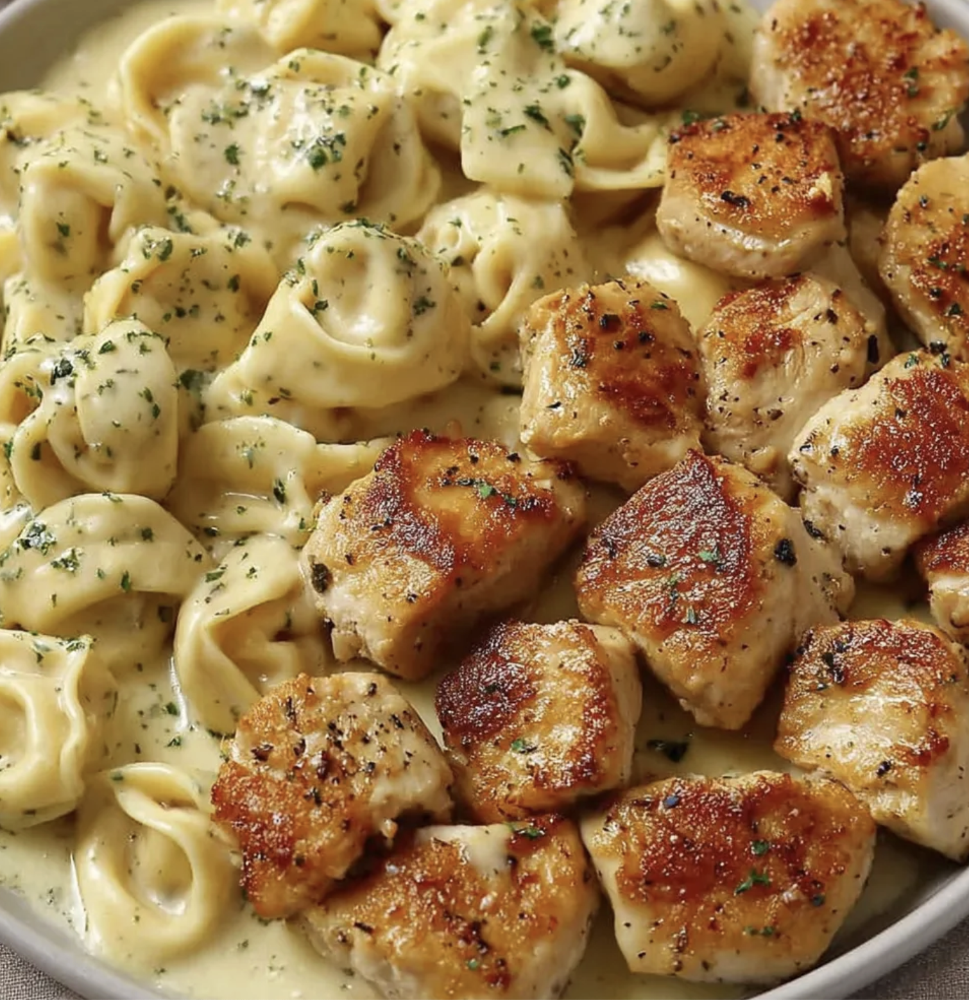

Ось адаптований рецепт спеціально під твій набір інгредієнтів та техніку, у зручному форматі для готування.

# Курячі Bites з равіолі під соусом Arla та сиром Regato

### 🛒 Інгредієнти

- **Куряче філе:** 2 невеликих шт. (350-400 г)
- **Равіолі Barilla (з сиром):** 1 упаковка (250 г)
- **Крем-сир Arla:** 150 г
- **Сир Regato:** 100–120 г (натерти на крупній тертці)
- **Вершкове масло:** 1 ст. л.
- **Часник:** 2–3 зубчики
- **Спеції:** паприка, сіль, чорний перець
- **Вода від пасти:** 50-80 мл (не виливай усю після варіння!)
- **Зелень:** свіжа петрушка або базилік (з балкона)

---

### 🥣 Процес приготування

**1. Підготовка компонентів:**

> равіолі

- **Відвари 250 г равіолі** у киплячій воді на **2 хвилини МЕНШЕ**, ніж вказано на пачці (щоб були пружними).
- **Важливо:** набери кружку води **50-80 мл, у якій вони варилися**, перш ніж зливати.

> Куряче філе

- Нарізати **кубиками 2х2** см **Куряче філе:** 2 невеликих шт
- **Розтопи** в формі 1 ст. л. **вершкового масла** 1 хв.
- Додай 1 ст. л. **оливковоі оліі**
- **Додай шматки філе**, перемішай
- **посоли, поперчи**
- додай **паприку**
- **Перемішай**

**2. Перший етап в аерогрилі (Курка):**

- Готуй **10 хвилин при 200°C**.
- **Перемішай** в середені запікання
- Курка має стати золотистою, але залишитися соковитою всередині.

**3. Збирання соусу (прямо у формі для запікання):**

- Подрібни 2 зубчики часнику
- Натри на **крупній** терці **Сир Regato:** 100–120 г
- Поклади в форму **150–200 г крем-сир Arla**
- подрібнений **часник**
- додай приблизно 80–100 мл гарячої **води від равіолі**
- Ретельно **розмішай** ложкою до однорідного кремового стану.
- Додай **дрібку перцю**.

**4. Об'єднання:**

- Додай у форму **відварені равіолі**
- Обережно **перемішай**, щоб кожен равіолі був вкритий соусом.
- Рясно засип усе зверху **тертим Regato**.

**5. Фінальне запікання:**

- Постав форму в аерогриль.
- Запікай **5–7 хвилин при 180°C**, поки Regato не розплавиться і не з'являться характерні золотисті «острівці» запеченого сиру.

**6. Подача:**

- Дай страві «відпочити» 2 хвилини (соус трохи загусне).
- Посип свіжою зеленню (петрушка або базилік)

---

### 💡 Поради для твого стилю:

- **Hi-Protein:** Ця страва виходить дуже ситною за рахунок подвійного білка (курка + равіолі з сиром) та жирів з Arla/Regato.
- **Текстура:** Regato дасть саме ту тягучу структуру, якої не вистачало б з пармезаном.
- **Енергоцінність:** Оскільки ти займаєшся спортом, це ідеальний "Post-Workout" обід для відновлення сил.
