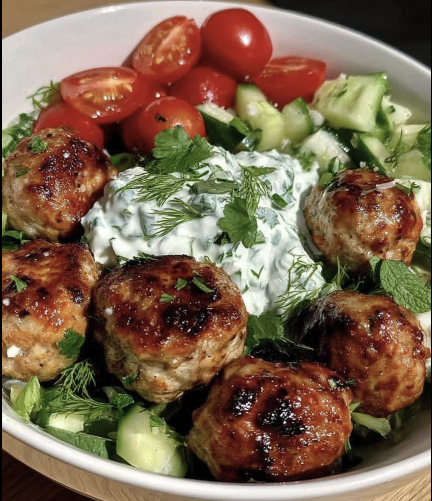

# 🇬🇷 Курячі кефтедес з соусом Цацикі

## 🛒 Інгредієнти для кульок (на 300 г фаршу):

- **Курячий фарш:** 300 г.
- **Яйце:** Тільки жовток 1 маленького яйця.
- **Червона цибуля:** 1/4 невеликої цибулини (дуже дрібно нарізати).
- **Часник:** 1 великий зубчик (через прес).
- **Кріп (Dill):** 1 ст. л. свіжого подрібненого.
- **Зелень:** 1 ч. л. свіжого **орегано** та **чебрецю** (дрібно посікти).
- **Цедра лимона:** 1/4 ч. л. (тільки жовта частина) — це критично для свіжості!
- **Спеції:** дрібка пластівців чилі, сіль та чорний перець за смаком.
- **Оливкова олія:** 1 ч. л. (у фарш, щоб курка не була сухою).
- **Червоний винний оцет:** 0.5 ч. л. (розпушує волокна м'яса).

- **Тверда Фета (Опціонально):** 30-50 г

---

### 👨‍🍳 Приготування

- **Розділіть яйце:** Покладіть **жовток** у фарш одразу. Він дасть жирність (якої бракує курячій грудці) та ніжність.
- **Червона цибуля:** 1/4 невеликої цибулини (дуже дрібно нарізати).
- **Кріп:** 1 ст. л. свіжого - подрібнити.
- **Орегано та чебрець:** 1 ч. л. свіжого - дрібно посікти.
- **Цедра лимона:** 1/4 ч. л. - натерти на дрібній тертці.

> **Велика миска - Змішайте:**

- **Курячий фарш:** 300 г.
- **Жовток**
- **Тверда Фета:** 30-50 г - розкришіть її на дрібні шматочки (не в пасту, а саме шматочками)
- **Нарізана цибуля**
- **Часник:** 1 великий зубчик (через прес).
- **Кріп (Подрібнений)**
- **Орегано та чебрець**
- **Цедра лимона:** 1/4 ч. л. (тільки жовта частина) — це критично для свіжості!
- **дрібка пластівців чилі**
- **сіль та чорний перець:** за смаком.
- **Оливкова олія:** 1 ч. л. (щоб курка не була сухою).
- **Червоний винний оцет / Бальзамічний оцет:** 0.5 ч. л. (розпушує волокна м'яса).
- Не вимішуйте занадто довго, щоб вони не стали «гумовими».

  > ❄️ Найважливіший етап для аерогрилю:

- Після того, як ви все змішали, поставте миску в холодильник на **20-30 хвилин**.
  - Холодний жир і білок «схопляться».
  - Вам буде в 10 разів легше формувати ідеальні кульки.
  - Коли ви покладете холодну кульку в гарячий аерогриль, вона миттєво візьметься скоринкою і залишиться круглою.

2.  **Формування:** Змочіть руки олією (не водою!), сформуйте кульки.
    - **Який розмір краще?** Для аерогрилю ідеальний розмір — **як волоський горіх (вага приблизно 30-35 грамів)**. З 300 г фаршу у вас вийде приблизно 9-10 кульок.
    - _Чому саме такий розмір?_ Вони швидко приготуються (не встигнуть висохнути всередині) і матимуть гарну скоринку з усіх боків.
      Якщо фарш здається вам занадто вологим через відсутність панірувальних сухарів (ми ж робимо Low-carb), можете додати 1 ст. л. мигдального борошна або просто дуже добре віджати цибулю після нарізання.
3.  **Аерогриль:**
    - Змастіть кульки оливковою олією (спреєм).
      > 🔥 Випікання **200°C / 7-8 хвилин**. На 6-й хвилині струсіть кошик, щоб вони перевернулися.
    - _Важливо:_ Не перетримайте! Курка готується швидко. Цільтеся в 74°C всередині.

---

# Tzatziki

Секрет ідеального цацикі — у **відсутності зайвої вологи**. Якщо просто все змішати, соус через 5 хвилин «попливе».

### 🛒 Інгредієнти

- **Грецький йогурт (Strained/Στραγγιστό):** 200 г. Обов'язково густий (5% або 10% жирності).
- **Огірок:** 1 середній. Краще брати «англійський» довгий огірок з дрібним насінням.
- **Часник:** 1–2 зубчики (залежить від вашої любові до гострого).
- **Винний оцет / яблучний оцет / лимонний сік:** 1 ст. л. (у Греції частіше використовують саме оцет, він дає той самий «правильний» смак, але можна замінити лимоном).
- **Оливкова олія (Extra Virgin):** 1-2 ст. л.
- **Свіжий кріп (Dill):** невеликий пучок.
- **Сіль:** 3/4 ч. л.

---

### 👨‍🍳 Технологія приготування

- Натріть 1 огірок на грубій тертці (разом зі шкіркою, якщо вона не гірка).
- Додайте до натертого огірка 1/3 ч. л. солі, перемішайте і залиште в мисці на **5–10 хвилин**. Сіль витягне зайву воду.
- Натріть 1–2 зубчики часнику на дрібній тертці або розітріть у пасту з дрібкою солі за допомогою ножа.

> Змішайте в окремій маленькій ємності за 5 хвилин до змішування з йогуртом:

- **Часник**
- **яблучний оцет / лимонний сік:** 1 ст. л.
- **Оливкова олія:** 1 ст. л.
  Кислота «приборкає» агресивність сирого часнику, і у вас не буде печії.

- Дрібно наріжте тільки ніжні частини кропу (невеликий пучок без грубих стебел).

- **Критичний момент:** Візьміть марлю або чистий кухонний рушник, викладіть туди огірок і **відіжміть його щосили**. Огіркова маса має стати майже сухою.

#### Фінальне змішування

- У глибоку миску викладіть 200 г. йогурт.
- Додайте віджатий огірок, часникову суміш та кріп.
- Додайте ще 1/4 чайної ложки солі (або велику дрібку).
- Ретельно перемішайте ложкою (не блендером!).

## Дайте йому «відпочити» | Подача для відео

- Цацикі смакує набагато краще, якщо постоїть у холодильнику хоча б 30–60 хвилин. Смаки часнику та кропу мають «подружитися» з йогуртом.
- Викладіть соус у керамічну піалу, зробіть ложкою невелике заглиблення («колодязь»), налийте туди трохи оливкової олії та покладіть одну оливку Каламата в центр. Це класичний грецький візуал.
- **Консистенція:** Правильний цацикі має бути таким густим, щоб він тримався на шматочку м'яса або овочі і не стікав. Завдяки вашому сильному віджиманню огірка, він буде саме таким.

---

## З'йомка

## 🛒 Інгредієнти

- **Курячий фарш:**
- **Яйце:** 1+1 маленьк яйця
- **Червона цибуля:** 1/4 невеликої цибулини (дуже дрібно нарізати).
- **Часник:** 1+1+1 зубчики
- **Кріп (Dill):** 1 ст. л. свіжого подрібненого + невеликий пучок.
- **свіжого орегано** - 4 маленька гілочка
- **свіжого чебрецю** - 2 маленька гілочка
- **Лимон** 1/4 ч. л. цедри
- **Кумін:** 3 зернятка
- **Чилі:** дрібка пластівців
- **Сіль**
- **чорний перець**
- **Оливкова олія:** - бутилка
- **Оливкова олія (EVOO):** спрей
- **Грецький йогурт (Strained/Στραγγιστό):** 200 г.
- **Огірок:** 1 + 1
- **яблучний оцет:** 1 ст. л.
- **Пармезан:** 50g
- **Томати чері:** 12 + 6 шт. (цілі)
- **Сир Моцарела:** 70g
- **Фета:** 50g
- **В’ялені томати:** 3-4 шт.
- **Каперси:** 1 ч. л.
- **Оливки:** 3+1 шт.

> Tzatziki

- Натріть 1 **огірок** на грубій тертці
- Додайте до натертого огірка 1/3 ч. л. **солі**, перемішайте і залиште в мисці на **5–10 хвилин**.

- Натріть 1–2 зубчики **часнику** на дрібній тертці або розітріть у пасту з дрібкою солі за допомогою ножа.

> Змішайте в окремій маленькій ємності:

- **Часник**
- **яблучний оцет / лимонний сік:** 1 ст. л.
- **Оливкова олія:** 1 ст. л.

- Дрібно наріжте тільки ніжні частини **кропу** (невеликий пучок без грубих стебел).

- У глибоку миску викладіть 200 г. **йогурт**.
- Візьміть марлю або чистий кухонний рушник, викладіть туди огірок і **відіжміть його щосили**.
- Додайте **віджатий огірок**, **часникову суміш** та **кріп**.
- Додайте ще 1/4 чайної ложки солі (або велику дрібку).

- Ретельно **перемішайте** ложкою (не блендером!).

- ❄️ у **холодильник**.

> Meatballs

- Відокремте **жовток** у Велику миску з фаршем одразу.
- **Кріп:** 1 ст. л. свіжого - подрібнити - у фарш.
- **Орегано та чебрець:** 1 ч. л. свіжого - дрібно посікти - у фарш.
- **Цедра лимона:** 1/4 ч. л. - натерти на дрібній тертці - у фарш.
- **1/4 невеликої цибулини** - **дуже дрібно нарізати**, **Промокнути** паперовими рушниками - у фарш.
- **Часник:** 1 великий зубчик на дрібній тертці - у фарш.
- **дрібка пластівців чилі** - у фарш.
- **сіль та чорний перець:** за смаком- у фарш.
- **Оливкова олія:** 1 ч. л. - у фарш.
- **Бальзамічний оцет:** 0.5 ч. л. - у фарш.
- **Тверда Фета:** 30-50 г - розкришіть її на дрібні шматочки (не в пасту, а саме шматочками) - у фарш.
- Не **вимішуйте** занадто довго, щоб вони не стали «гумовими».
- Візьміть **половину білка**, збийте його виделкою до появи пухирців і додайте до фаршу.
- Якщо фарш здається вам занадто вологим, можете додати 1 ст. л. мигдального борошна або просто дуже добре віджати цибулю після нарізання.

> ❄️

- Поставте миску в холодильник на **20-30 хвилин**.

- **Сформуйте кульки** - Змочіть руки олією (**не водою!**), сформуйте кульки розміром з мьяч для пінг-понгу

> 🔥

- **! Добре Змастіть** кульки оливковою олією (спреєм) - для кращої скоринки.
- 🔥 Випікання **200°C / 7-8 хвилин**
- _Важливо:_ Цільтеся в **72-73°C** всередині.

> **Подача**

- Наріж **Огірок півкільцями**, **Томати чері навпіл**, **Кріп середньо**.

> 1

- Викладіть **половину соусу у керамічну теракотову піалу**, зробіть ложкою невелике **заглиблення** («колодязь»), налийте туди **трохи оливкової олії** та покладіть **одну оливку** Каламата в центр. Це класичний грецький візуал
- поставте **піалу по центру** великоі тарілки,
- навколо **з одного боку викладіть Огірки**.
- з **іншого боку викладіть Томати** чері,
- **Зверху огірків викладіть кульки мьяса**.
- **Посипте** все це свіжим **кропом**.

> 2

- В **чорну тарілку** виклади:
- **другу половину соусу** по центру, ложкою **зроби кільце**,
- **в центр кільця поклади кульки м'яса**,
- **навколо них виклади огірки та томати чері**.
- **Посип свіжим кропом**.
