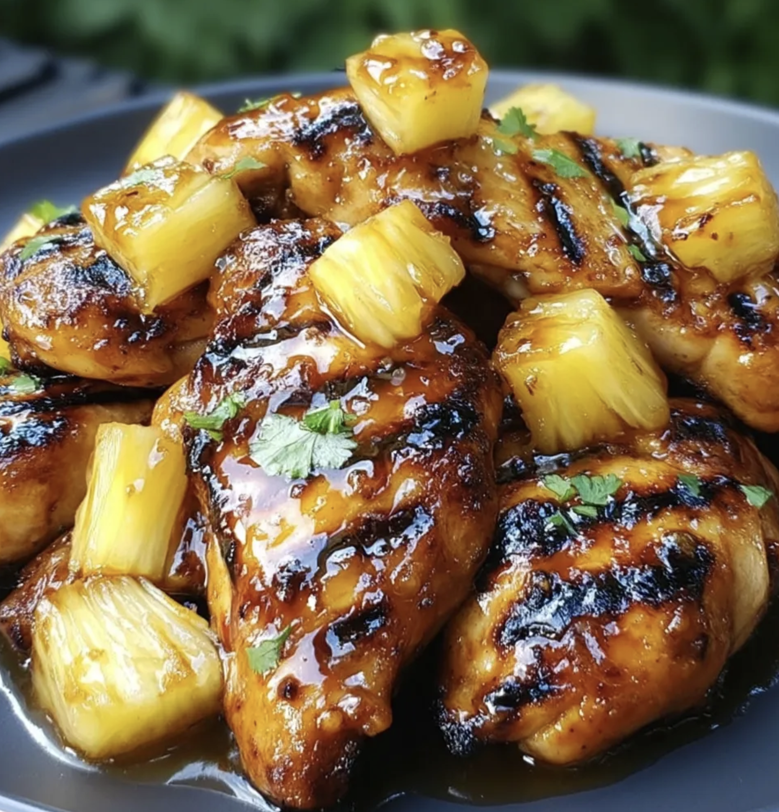

# Тропічна курка з ананасом в аерогрилі

### 🛒 Інгредієнти

- **Курка (філе):** 300 г
- **Стиглий ананас (сік):** з половинки великого кільця
- **Мед:** 1/2 ст. л.
- **Соєвий соус:** 1 ст. л.
- **Часник:** 1 зубчик
- **Сушений імбир:** на кінчику чайноі ложки
- **Оливкова олія:** 1/2 ст. л.
- **Сік лайма або лимона:** 1/4 шт.
- **Кукурудзяний крохмаль:** 1/2 ч. л. (Крохмаль затримає вологу всередині і створить ту саму липку, глянцеву скоринку)
- **Fresh Red Chili:** 1/3 pepper, thinly sliced (seeds removed).
- **Чорний мелений перець:** 1/4 ч. л.
- **Сухий часник:** 1/4 ч. л.
- **Сіль:** 1/4 ч. л. (враховуй солоність соєвого соусу)

---

### 🥣 Процес приготування

- Поклади мьясо на чорну дошку
- **Промокни курку паперовим рушником**
- Придави чистою бутилкою мьясо (для рівномірноі товщини)
- Змасти мьясо оливковою олією
- Посоли
- Поперчи
- додай сухий часник
- залиш

---

- Візьми **2 великих кільця стиглого ананаса**
- 1/2 кільця подрібни до стану пюре і вичави сік через сито для маринаду, а іншу частину наріж невеликими **кубиками або скибками**.
- **промокни шматочки ананасу паперовими рушниками**

- **1/3 Fresh Red Chili** - Наріж тоненькими кільцями на маленькій дошці.

> У мисці змішай

- **сік з ананаса**,
- **1 ст. л. соєвого соусу**,
- **1/2 ст. л. оливкової олії**,
- **сік з 1/4 лайма**
- Додай 1/2 ч. л. **Кукурудзяний крохмаль**
- Добре перемішай до повного розчинення крохмалю
- **1/2 ст. л. меду**,
- **Сіль:** 1/4 ч. л. (Опціонально)
- **1/8 ч. л. сушеного імбиру**
- **1 подрібнений зубчик часнику**.
- **Чорний мелений перець:** 1/4 ч. л.
- **60% перцю Чилі**

- **вилий глазур в маленький сотейник**.
- Став на **середній вогонь**.
- Весь час постійно помішуй силіконовою лопаткою. Чому це важливо: У маринаді є мед і цукор із соку — вони дуже легко прилипають до дна і починають гірчити, якщо їх не рухати. Спочатку маринад буде мутним (через крохмаль).
- Як тільки він почне закипати:
  - Він миттєво змінить колір: з мутного стане прозорим і глянцевим.
  - Текстура: Він стане схожим на рідкий мед або густий сироп.
- Як тільки соус загус і став прозорим (це займе 2–4 хвилини після закипання) — одразу знімай з вогню. Якщо переварити крохмаль, він може знову «відсіктися» і стати рідким, або перетворитися на гумове желе:
  - Готова глазур має стікати з ложки «ледачою», важкою цівкою. Саме така ідеально триматиметься на курці!

---

- Розігрій аерогриль до **200°C**.
- Виклади м'ясо в кошик **некрасивою стороною догори**.
- **поклади сухі! кубики ананасу на решітку** поруч із м'ясом і збризни іх оливковою олією
- Готуй при **200°C** / **12–13 хвилин**.

> **На середині процесу (через 6-7 хвилин):**

- відкрий аерогриль і **переверни курку**
- пензликом **змасти курку і ананас цією глазур'ю**.

### Фінальний штрих

- натри зверху **половиною цедри Лайма**
- Хоча рецепт тропічний, твій **зелений базилік** (якщо це не занадто "італійський" сорт, а звичайний солодкий) або навіть дрібно нарізана кінза (якщо є) ідеально підійдуть для фінального кадру.
- **40% перцю Чилі:** Свіжі кільця чилі зверху на готову курку.

---
